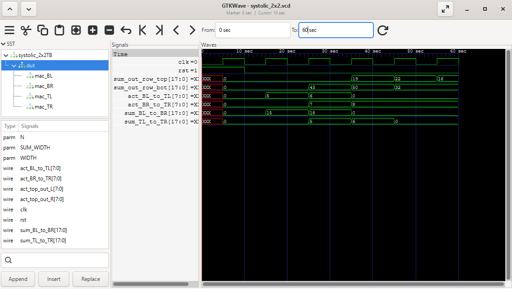

# Weight-Stationary Systolic Array (2×2)

A 2×2 systolic array of multiply-accumulate units, written in Verilog and verified in simulation with Icarus Verilog and GTKWave.

## Abstract

In an effort to understand how modern accelerators actually perform matrix multiplication, I set out to build the arithmetic engine sitting at the center of Google's first Tensor Processing Unit: the systolic array. Rather than fetching operands from memory for every single multiply, this design holds its weights in place and lets the data march through a grid of processing elements, with each one handing its results directly to its neighbors. The result is a 2×2 array built from four identical multiply-accumulate units, tested first in isolation and then as a complete grid, which correctly computes a 2×2 matrix product entirely in hardware.

## Introduction

Matrix multiplication is the single most expensive thing a neural network does, and the naive way of doing it is wasteful in a way that's easy to miss. If we multiply two matrices the obvious way, every multiply requires reaching back into memory for its operands. Arithmetic is cheap and memory is slow, so before long we aren't waiting on the multiplier at all, we're waiting on memory. This is the bottleneck the systolic array was built to dodge.

The idea, first formalized by H.T. Kung in 1982, is to stop treating the multiplier as something we feed and start treating it as something data flows through. Each processing element passes its operands directly to the neighbor beside it, so a value pulled from memory once gets reused across an entire row or column before it's discarded. The array stops being a unit we repeatedly load and becomes a fixed pipeline, which is where the name comes from, since the data pulses through the grid the way blood pulses through a circulatory system.

There are a few ways to arrange this, and the choice comes down to which operand we decide to pin down. In an output-stationary array, each partial sum stays put while both operands stream past. In a weight-stationary array, which is what I built and what the TPU v1 uses, each processing element latches one weight and holds it for the entire multiply. While both arrangements work, the weights in a neural network layer get reused across every input in the batch, so pinning them down is what buys us the most. From here, activations move upward through the columns and partial sums move rightward along the rows, picking up one product at every element they pass through. By the time a partial sum falls off the right edge of the array, it is a finished dot product.

## The Processing Element

Before building the grid, we need the cell it's made of. Each processing element is a multiply-accumulate unit, or MAC, and it is refreshingly simple. On every rising clock edge it performs exactly one operation:

```verilog
act_out <= act_in;                      // pass the activation upward
sum_out <= sum_in + (weight * act_in);  // accumulate and pass rightward
```

That's the whole processing element. It takes in an activation and a partial sum, multiplies the activation by the weight it's holding, adds that product to the incoming partial sum, and registers both the new sum and the untouched activation for its neighbors to collect next cycle. Because every output is registered, the array is fully pipelined, giving us one multiply-accumulate per element per cycle.

The interesting design question here isn't the arithmetic, it's the bit widths. If we're careless about sizing the accumulator, the partial sums overflow silently and the array produces confident nonsense. Working through it: two 8-bit operands multiply into at most 16 bits, and summing `N` of those products needs another `log₂(N)` bits of room. I added one more bit as a guard, which gives us the formula used in the module:

```verilog
parameter SUM_WIDTH = (WIDTH*2) + $clog2(N) + 1
```

With `WIDTH = 8` and `N = 2`, that works out to `16 + 1 + 1 = 18` bits. The multiplication itself can never overflow an 18-bit accumulator for a 2×2 array, which is exactly the guarantee we want.

## Building the Array

With a working processing element, we can wire four of them into the grid. Figure 1 shows how they connect, using the actual signal names from `rtl/systolic_2x2.v`.

*Figure 1: 2×2 Weight-Stationary Array Dataflow*

```
                  act_top_out_L         act_top_out_R
                     (unused)              (unused)
                         ▲                     ▲
                         │                     │
                  ┌──────┴──────┐       ┌──────┴──────┐
   sum_in = 0 ───▶│   mac_TL    │──────▶│   mac_TR    │───▶ sum_out_row_top
                  │ w=[0][0]=1  │  sum  │ w=[0][1]=2  │
                  └──────▲──────┘       └──────▲──────┘
                         │ act_BL_to_TL        │ act_BR_to_TR
                  ┌──────┴──────┐       ┌──────┴──────┐
   sum_in = 0 ───▶│   mac_BL    │──────▶│   mac_BR    │───▶ sum_out_row_bot
                  │ w=[1][0]=3  │  sum  │ w=[1][1]=4  │
                  └──────▲──────┘       └──────▲──────┘
                         │                     │
                  act_in_cols[0]        act_in_cols[1]
```

Reading the diagram, two things are worth pointing out. First, the leftmost elements in each row have their `sum_in` tied to zero, since there's no neighbor to their left to accumulate from, so they start every dot product from scratch. Second, the activations exiting the top of the array go nowhere. In a taller array they'd feed the next row up, but in a 2×2 grid the top row is the end of the line, so `act_top_out_L` and `act_top_out_R` are left deliberately unconnected.

Currently all four instantiations are written out by hand, which is fine at this size and clearly doesn't scale. Generalizing this to an N×N array with `generate` blocks is the first item on the roadmap below.

## Feeding the Array

Here's the part that took me the longest to wrap my head around, and it's the part that makes a systolic array feel genuinely different from ordinary hardware. We cannot simply present both matrices to the array and read the answer. Because data physically takes a cycle to move between neighbors, the inputs have to be **skewed**, meaning each column's activations enter one cycle later than the column beside it.

The reason is timing. A partial sum arriving at `mac_TR` from `mac_TL` is one cycle old by the time it gets there, so the activation it needs to meet has to arrive at that same moment, not a cycle earlier. Feeding both columns simultaneously would have the array adding products that belong to different dot products entirely. Getting this wrong was the source of nearly every wrong number I saw while bringing the design up.

Multiplying weight matrix `A` by activation matrix `B`:

```
A = | 1  2 |        B = | 5  6 |        A × B = | 19  22 |
    | 3  4 |            | 7  8 |                | 43  50 |
```

The activations get fed in transposed and staggered, which is what the testbench sets up:

```
Cycle:      1     2     3
Col 0:      5     6     -       <- row 0 of B
Col 1:      -     7     8       <- row 1 of B, delayed one cycle
```

## Running It Yourself

Both testbenches build and run with Icarus Verilog. The `-g2012` flag is required, since the array passes its weights as an unpacked array port, which is a SystemVerilog construct that the default Verilog-2005 mode rejects.

```bash
# Single processing element
iverilog -g2012 -o mac_sim tb/macTB.v rtl/mac.v
vvp mac_sim

# Full 2x2 array
iverilog -g2012 -o sys tb/systolic_2x2TB.v rtl/systolic_2x2.v rtl/mac.v
vvp sys
```

Note that `rtl/mac.v` holds a module named `mac_unit`, so it has to be listed on the command line explicitly. Icarus can also search a directory for missing modules with `-y rtl`, but that option matches modules to files by name, so it would only work here if the file were renamed to `mac_unit.v`.

Both testbenches write a VCD, which can be opened for waveform inspection:

```bash
gtkwave systolic_2x2.vcd
```

## Results

Starting with the single processing element, `tb/macTB.v` checks the fundamental operation by computing `3 × 4 + 5`:

```
sum_out =     17 (expected 17)
```

Moving up to the full array, `tb/systolic_2x2TB.v` streams the skewed activations through and prints both row outputs every cycle:

```
sum_out = [     0,      0] ([0,0])
sum_out = [    43,      0] ([43,0])
sum_out = [    50,     19] ([50,19])
sum_out = [    32,     22] ([32,22])
```

The values in parentheses are the expected results, printed alongside the measured ones.

Reading those four lines as a table makes the behavior much clearer.

*Table 1: Array Output vs. Expected Matrix Product*

| Cycle | `sum_out_row_bot` | `sum_out_row_top` | Meaning |
|---|---|---|---|
| 1 | 0 | 0 | Pipeline still filling |
| 2 | **43** | 0 | `C[1][0]` = 3·5 + 4·7 ✔ |
| 3 | **50** | **19** | `C[1][1]` = 3·6 + 4·8 ✔, `C[0][0]` = 1·5 + 2·7 ✔ |
| 4 | 32 | **22** | `C[0][1]` = 1·6 + 2·8 ✔ |

Every value of the expected product `[[19, 22], [43, 50]]` comes out of the array correctly. Notice that the bottom row finishes a full cycle before the top row, which isn't a bug, it's the skew we deliberately introduced on the input side working its way through to the output side.

Admittedly, there's one number in there that doesn't belong. That `32` in the final cycle is not part of the answer, it's the array faithfully multiplying stale data. The testbench stops feeding new activations after cycle 3 but never flushes the pipeline with zeros, so `mac_BR` happily computes `4 × 8 = 32` using the activation still sitting on its input. The hardware is doing exactly what it was told. The testbench simply stopped talking before the array stopped listening, and draining the array with explicit zeros is the clean fix.

The same thing happens once more on the way out, a cycle later and one row up, which we'll see in the waveform below as a trailing `16` on the top row. It's the identical story, `mac_TR` multiplying its weight of 2 by an activation of 8 that nobody ever cleared.

## Waveform Evidence

Console output tells us the answers came out right, but it doesn't tell us the array earned them. For that we need to watch the internal wires, which is what Figure 2 captures. Along with the two row outputs, it probes the four wires connecting the processing elements to each other, so we can watch operands physically move through the grid.

*Figure 2: GTKWave Capture of the Array's Internal Dataflow*



Reading it left to right, the reset holds everything at zero until 10, and the first rising edge afterward starts the array moving. Table 2 walks through what each edge produces.

*Table 2: Internal Wire Values at Each Clock Edge*

| Time | Wire | Value | Where it came from |
|---|---|---|---|
| 15 | `act_BL_to_TL` | 5 | `mac_BL` passes its activation up to `mac_TL` |
| 15 | `sum_BL_to_BR` | 15 | `mac_BL` computes 3 · 5, the array's first product |
| 25 | `act_BR_to_TR` | 7 | Column 1's first activation, one cycle behind column 0 |
| 25 | `sum_TL_to_TR` | 5 | `mac_TL` computes 1 · 5 |
| 25 | `sum_BL_to_BR` | 18 | `mac_BL` computes 3 · 6 |
| 25 | `sum_out_row_bot` | **43** | `mac_BR` adds 4 · 7 to the 15 it received |
| 35 | `sum_TL_to_TR` | 6 | `mac_TL` computes 1 · 6 |
| 35 | `sum_out_row_top` | **19** | `mac_TR` adds 2 · 7 to the 5 it received |
| 35 | `sum_out_row_bot` | **50** | `mac_BR` adds 4 · 8 to the 18 it received |
| 45 | `sum_out_row_top` | **22** | `mac_TR` adds 2 · 8 to the 6 it received, completing the product |
| 45 | `sum_out_row_bot` | 32 | Stale activation, the input stream has ended |
| 55 | `sum_out_row_top` | 16 | Stale activation on the top row, one cycle later |

Three things in this capture are worth calling out, because together they're the real proof the design works rather than merely producing the right digits.

First, the skew is visible. `act_BL_to_TL` picks up its first value at 15 while `act_BR_to_TR` doesn't move until 25, exactly one clock period behind. That's the staggered input schedule from earlier, and seeing it on the wire confirms the columns really are offset rather than the answer coming out right by luck.

Next, we can watch a partial sum grow as it crosses the array. At 15, `sum_BL_to_BR` holds 15, which is `mac_BL`'s product alone. One cycle later that same 15 has traveled to `mac_BR`, been added to `4 · 7`, and emerged on `sum_out_row_bot` as 43. That is a dot product being assembled in two pieces by two different elements, one cycle apart, which is the entire premise of a systolic array made visible.

The two trailing values, `32` at 45 and `16` at 55, are the undrained-pipeline artifact described above, now visible as the tail of the capture rather than a stray line of console output.

Lastly, the row offset shows up on the output side. `sum_out_row_bot` produces 43 at 25, a full cycle before `sum_out_row_top` produces 19 at 35. The bottom row finishes first because its activations entered first, so the skew we introduced at the input propagates all the way through to the output. Reading these two rows as if they appeared simultaneously is exactly the mistake that makes a working array look broken.

One caveat on the figure, the time axis reads in seconds because `tb/systolic_2x2TB.v` has no `` `timescale `` directive, so the simulator falls back to its default unit. It has no effect on the arithmetic, but the units are meaningless and the directive belongs in the testbench.

## Limitations

Knowing where a design stops is part of the design, so stated plainly:

- **Fixed at 2×2.** All four processing elements are instantiated by hand, so the array size is hardcoded.
- **Simulation only.** This has never been through synthesis, so there are no area, timing, or power numbers to show, and no guarantee every construct here is synthesizable.
- **Unsigned arithmetic.** Nothing is declared `signed`, so the array handles unsigned operands only. Real neural network weights are signed, so this is the most important gap.
- **The testbenches are not self-checking.** They print results next to hand-computed expected values rather than asserting on them, so a failure gets reported by me reading the output, not by the simulator.
- **No memory interface.** Weights and activations are driven directly by the testbench. There's no bus interface, no weight-load state machine, and no buffering.
- **The pipeline is not drained.** As seen above, the array keeps computing on stale activations once the input stream stops.

Two smaller things worth flagging. `tb/macTB.v` declares its `sum_in` and `sum_out` as 17 bits while the module's ports are 18, so Icarus pads the difference and warns about it. The test still passes, but the testbench should match the module's `SUM_WIDTH` formula rather than hardcoding a width. Separately, `tb/systolic_2x2TB.v` is missing a `` `timescale `` directive, which is why its waveform reads in seconds.

## Roadmap

- [ ] Generalize to N×N using `generate` blocks
- [ ] Move to signed arithmetic so the array handles real weights
- [ ] Convert both testbenches to self-checking with pass/fail assertions
- [ ] Add a Python/NumPy golden model instead of hand-computed expected values
- [ ] Drain the pipeline properly at the end of an input stream
- [ ] Run through Yosys for real area and timing numbers
- [ ] Add a weight-load FSM so weights stream in rather than being set directly
- [ ] Add a `` `timescale `` to the array testbench so waveforms read in nanoseconds

## Repository Layout

```
rtl/
  mac.v               # the multiply-accumulate processing element (module mac_unit)
  systolic_2x2.v      # the 2x2 array, instantiating four MACs
tb/
  macTB.v             # unit test for a single processing element
  systolic_2x2TB.v    # array-level test, full 2x2 matrix multiply
docs/
  waveform.png        # GTKWave capture of the array's internal dataflow
```

## Conclusion

Rather than proving that matrix multiplication can be done in hardware, which was never in question, this project proved to me how much of accelerator design lives in the timing rather than the arithmetic. The multiply-accumulate unit at the heart of all this is four lines of Verilog, and it worked almost immediately. The hard part, and the part that actually taught me something, was the choreography around it: sizing the accumulator so partial sums can't silently overflow, skewing the input stream so the right operands meet at the right element on the right cycle, and reading waveforms carefully enough to tell a real bug apart from a pipeline that simply hasn't filled yet. All in all, going from a single MAC to a working grid took the entire toolset, and it left me with a much more concrete picture of what's actually happening inside a TPU. Also, it taught me that when the numbers come out wrong, the problem is almost always one cycle off rather than one multiply off.

## References

- Kung, H.T., *Why Systolic Architectures?*, IEEE Computer, 1982. The original formulation.
- Jouppi et al., *In-Datacenter Performance Analysis of a Tensor Processing Unit*, ISCA 2017. The TPU v1 paper whose weight-stationary dataflow this follows.

---

*Built by Jorge Manzano, Computer Engineering, University of Utah.*
